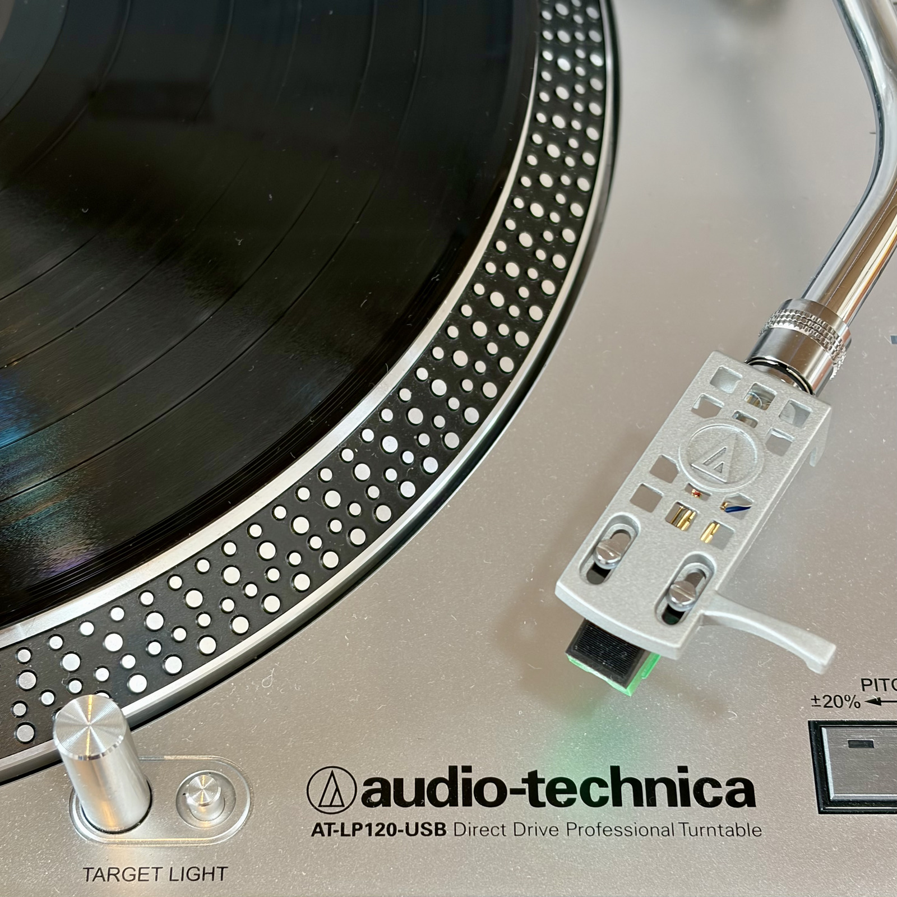

The only speaker setup I have is [Sonos](https://www.sonos.com/), so I naturally
wanted to connect my turntable to it. I connect it directly to my Raspberry Pi
with USB and stream its output to my Sonos using a
[Homebridge](https://homebridge.io/) switch.



I originally used [DarkIce](https://github.com/rafael2k/darkice) and
[Icecast](https://github.com/xiph/Icecast-Server) to send a 320 kbit/s MP3
stream. That worked well enough, but I wanted to move to FLAC (🤷). My first
attempt was to keep Icecast and change the format. I tried FLAC, but it did not
work with Sonos in this setup.[^icecast]

Next, I made a small Python HTTP server that captured the turntable, encoded
the audio as native FLAC, and sent it directly to Sonos. It was a bit of a
hack, even though an LLM made it surprisingly easy to get working. I wanted
something a little less hacky, rather than a server that had to manage a
capture and encoder process for every listener.

At that point, I stumbled on [Liquidsoap](https://github.com/savonet/liquidsoap).
It can capture the audio, encode native FLAC, and serve it with its built-in
Harbor HTTP server. It even restarts the external `arecord` process if the USB
capture device has a problem. That gave me the native FLAC stream I wanted
without keeping a custom streaming server around.

The complete path is:

```text
turntable -> ALSA -> arecord -> Liquidsoap -> Sonos
```

The Pi captures 16-bit, 48 kHz stereo audio. The FLAC stream is lossless after
the turntable's analogue-to-digital conversion. It cannot recover anything lost
by the record, the analogue signal chain, or that conversion, but it avoids
adding another lossy compression step.

## Install and configure

```sh
sudo apt install liquidsoap alsa-utils
```

The Raspberry Pi must see the turntable's USB audio interface. In my case, ALSA
gives it the stable card name `CODEC`:

```sh
cat /proc/asound/cards
arecord -l
```

I use this `/etc/asound.conf` to select the USB capture device, set the capture
format, and expose a software volume control:

```conf
pcm.dmic_hw {
    type hw
    card CODEC
    channels 2
    format dat
}

pcm.dmic_dsnoop {
    type dsnoop
    ipc_key 2900
    ipc_key_add_uid true
    slave {
        pcm dmic_hw
        format S16_LE
        rate 48000
        channels 2
        period_size 1024
        buffer_size 8192
    }
    bindings {
        0 0
        1 1
    }
}

pcm.dmic_sv {
    type softvol
    slave.pcm dmic_dsnoop
    control {
        name "Capture Volume"
        card CODEC
    }
    min_dB -5.0
    max_dB 20.0
}
```

Set the capture volume while playing real material. Do not copy a gain value
blindly, and check that loud records do not clip.

## Liquidsoap

Direct ALSA input was unreliable with this USB audio device,[^alsa] so
Liquidsoap starts `arecord` as an external raw PCM source. The working
configuration is in `/etc/liquidsoap/turntable.liq`:

```liquidsoap
settings.frame.audio.samplerate.set(48000)
settings.frame.audio.size.set(1024)
settings.frame.video.framerate.set(0)
settings.log.file.set(false)
settings.log.stdout.set(true)

turntable = input.external.rawaudio(
  id="turntable_input",
  samplerate=48000,
  channels=2,
  buffer=0.5,
  max=2.0,
  restart=true,
  restart_on_error=true,
  "/usr/bin/arecord --quiet --device dmic_sv --format S16_LE --rate 48000 --channels 2 --file-type raw"
)

output.harbor(
  id="turntable_flac",
  fallible=true,
  port=8082,
  mount="/turntable.flac",
  format="audio/flac",
  headers=[
    ("Cache-Control", "no-store")
  ],
  %flac(
    samplerate=48000,
    channels=2,
    compression=2,
    bits_per_sample=16
  ),
  turntable
)
```

The stream URL, replace the placeholder with the Pi's local hostname:

```text
http://<raspberry-pi-hostname>:8082/turntable.flac
```

## The Homebridge switch

Once the URL plays directly, I use the
[`homebridge-script2`](https://www.npmjs.com/package/homebridge-script2) plugin
to expose two shell commands as a Homebridge switch. Install the plugin in the
usual Homebridge way:

```sh
npm install -g homebridge-script2
```

I keep the [SoCo](https://github.com/SoCo/SoCo) scripts in a small
Python virtual environment:

```sh
python3 -m venv /opt/turntable
/opt/turntable/bin/pip install soco
```

I then add this accessory to Homebridge's `config.json`:

```json
{
  "accessory": "Script2",
  "name": "Turntable",
  "on": "/opt/turntable/bin/python /opt/turntable/play.py",
  "off": "/opt/turntable/bin/python /opt/turntable/stop.py"
}
```

The `on` command runs `play.py`:

```python
import soco

coordinator = soco.discovery.any_soco().group.coordinator
coordinator.play_uri(
    "http://<raspberry-pi-hostname>:8082/turntable.flac"
)
```

The matching `off` command runs `stop.py`:

```python
import soco

coordinator = soco.discovery.any_soco().group.coordinator
coordinator.stop()
```

Homebridge exposes these commands as a switch.

```sh
sudo -u homebridge \
  /opt/turntable/bin/python /opt/turntable/play.py
```

If a Sonos system has several independent groups, it is better to select the
intended coordinator by room name instead of discovering an arbitrary speaker.
In my case, discovering any speaker and then asking SoCo for that speaker's
group coordinator is a handy small trick because my speakers normally form one
group.[^sonos]

That is the whole idea: a turntable, a small Raspberry Pi, Liquidsoap serving
native FLAC, and a Sonos URL. It is a modest setup, but it lets me keep using
the turntable while listening in the same way as the rest of my Sonos audio.

[^icecast]: This describes my particular Icecast, Liquidsoap, and Sonos
    combination. The Raspberry Pi could capture the audio and encode it as
    FLAC, but Sonos could not use the Icecast-served endpoint as a live URI in
    the form I tried. The later Python server delivered native FLAC over plain
    HTTP and worked, which showed that the problem was the streaming endpoint,
    not the capture or the FLAC encoding. I did not investigate whether a
    different Icecast version, container, or header combination would have
    solved it. See the [Icecast documentation](https://icecast.org/docs/) and
    Liquidsoap's
    [encoding-format notes](https://www.liquidsoap.info/legacy/doc-dev/encoding_formats.html)
    for the broader format picture.

[^alsa]: I do not know exactly why. Liquidsoap's direct ALSA input returned
    `EINVAL` with this USB capture setup, while the same device worked through
    `arecord`. I was already using `arecord` in the earlier streaming setup,
    so keeping that small external process was easy and proved reliable enough
    for this version of the configuration.

[^sonos]: If you regularly use several independent Sonos groups, replace
    `any_soco()` with code that selects a known room. Otherwise, the discovered
    coordinator may be in a different group from the one you want to start.
